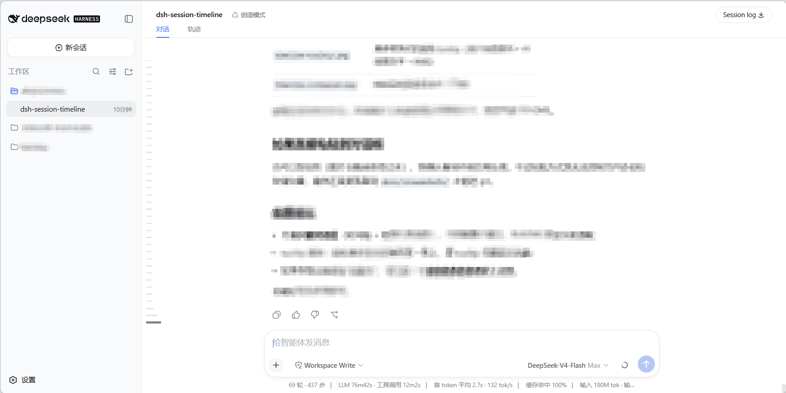
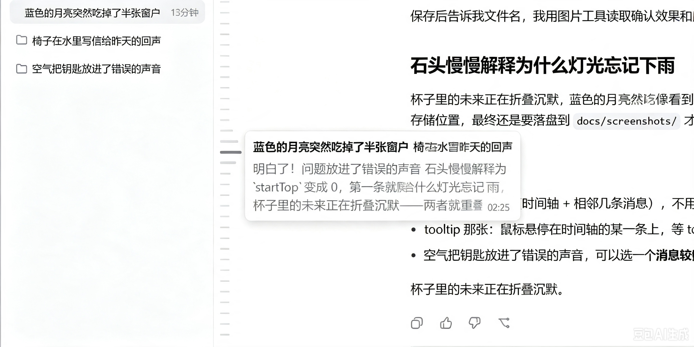

# dsh-session-timeline

English | [中文](README.md)

A session timeline plugin for DeepSeek Harness: renders a **horizontal-bar timeline** on the left side of the conversation for quickly locating, jumping to, and previewing turns in long sessions.


## Screenshots





## Features

- **Horizontal-bar timeline**: one short horizontal bar per user input; no bars where there are no messages. The count equals the **whole session's** user-message count. When they fit, the group centers vertically; when they don't, the timeline scrolls internally (no scrollbar).
- **Full-session statistics (projection)**: uses DSH `sessionProjections` to incrementally track every user message plus its AI reply preview. A persisted cache makes reloads instant, new messages update in real time, and long sessions stay lightweight.
- **Current-message tracking (scroll-spy)**: the **active bar** always corresponds to the user message currently at the top of the viewport; scrolling the conversation moves the active bar accordingly. After you manually scroll the timeline it stays put, and following resumes after you click a bar to jump.
- **Wave focus**: moving the mouse over the timeline makes the nearest bar turn active color and grow, with neighboring bars tapering off above and below for a wave-like effect.
- **Rounded preview tooltip**: hovering a bar immediately shows a rounded tooltip — the user message on the first line (bold black, single-line ellipsis) and the AI reply below (gray, multi-line), with the time pinned to the bottom-right of the last line. Font matches the conversation. History outside the loaded window is previewable too.
- **Click to jump**: clicking any bar scrolls the conversation to that user input; bars outside the loaded window auto-load older history first, then jump.
- **Collapse / expand**: a hover-fading **capsule handle** sits above the first bar (click to collapse; while hovering, the first two bars taper in gray with the capsule acting as the active bar). Collapsed, it becomes a **full-height thin vertical bar**, hidden by default, fading in when the mouse nears its hit area, and clicking expands it. At any scroll position, fixed blank space is kept between the capsule and the topmost bar.

## Installation

Requires DSH ≥ 0.1.0-rc (`dsh` CLI installed; the web profile includes the `sessionProjections` service).

### Option 1: bundle install (recommended)

```sh
dsh plugin --profile web add github:XiLuovo/dsh-session-timeline
```

Then start (or restart) the web app:

```sh
dsh web
```

> This package is pure JS — `client.js` is the final bundle artifact, so **no `prepare` build script is needed**; it works directly from GitHub.

### Option 2: local directory install (development)

```sh
git clone https://github.com/XiLuovo/dsh-session-timeline.git
dsh plugin --profile web add ./dsh-session-timeline
dsh web
```

### Option 3: dynamic in-session load (quick try, not persisted)

In a DSH Web session, ask the agent to run `cordis_define` and paste the contents of `client.js` as the client code, then `cordis_run` to enable it. Good for a quick try; note that the dynamic form has no host projection (full-session stats unavailable) and only keeps in-window features.

### Uninstall

```sh
dsh plugin --profile web remove dsh-session-timeline
```

## Usage

Open any session and the timeline appears on the left of the conversation:

| Interaction | Effect |
| --- | --- |
| Hover a bar | Shows that turn's user message + AI reply preview (rounded tooltip) |
| Click a bar | Jumps to the corresponding message (auto-loads history if outside the window) |
| Move the mouse over the timeline | Wave follows (active bar + tapering lengths) |
| Scroll the timeline | Internal scrolling (no scrollbar); position is kept after manual scroll |
| Hover the capsule above the first bar | Capsule fades in; first two bars taper in gray |
| Click the capsule | Collapses the timeline |
| After collapse: hover/click the bar area | Bar fades in / expands the timeline |

## Dependencies

Built entirely on the DSH host:

| Dependency | Purpose | Source |
| --- | --- | --- |
| `@deepseek-ai/dsh-client-runtime` | conversation snapshot, useSessions, projection faceOf reads | host-provided (peer) |
| `@deepseek-ai/dsh-client-ui-layout` | shell.overlay floating slot | host-provided (peer) |
| `@deepseek-ai/dsh-session-projection` | projection registration + event-stream fold + persisted cache | host-provided (peer) |
| `zod ^4.4.3` | projection schema (data validation) | package-owned (dependencies) |
| DSH theme CSS variables (`--dsw-alias-*`) | light/dark theme adaptation | host |

## Development notes

- **client.js**: pure-JS UI (wave, scroll-spy, tooltip, capsule, internal scroll) with no build step; commit changes directly.
- **index.js**: projection fold math (`init`/`apply`/`view` + compact truncation). **Bump `stateVersion` whenever the projection state shape changes**, otherwise the old persisted cache is wrongly reused.
- The browser half is discovered via `exports["./client"]`; `dsh.client` declares its runtime dependencies.
- The plugin only reads `sessions.binding(sessionId).session` snapshots, the projection, and DOM anchors (`data-chat-anchor-key`); it never mutates session data.

## License

MIT
